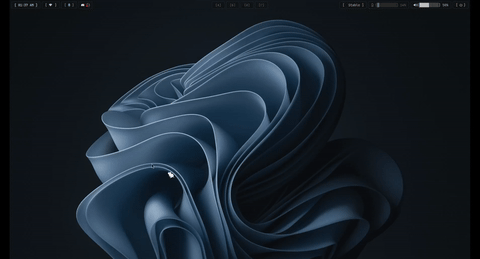

# oneko in rust

A rewrite of the classic [**oneko**](https://github.com/tie/oneko) desktop cat, in **Rust**, with:

- a **Wayland/Linux** build (original `oneko-rust`)
- a separate **macOS** build (`oneko-rust-macos`)

A little pixel-art cat chases your cursor around the screen. When you stop moving the mouse it sits down, washes itself, and eventually falls asleep.



## Why a rewrite?

The original oneko (and most clones) rely on X11 tricks — override-redirect windows and the SHAPE extension — that don't work under modern compositors.

The Linux build uses:

- **`wlr-layer-shell`** (via [smithay-client-toolkit](https://crates.io/crates/smithay-client-toolkit)) for an always-on-top overlay surface
- ARGB transparency

The macOS build is implemented as a separate binary and reuses the same sprite set and behavior state machine.

## Requirements

### Linux (Wayland)

- Linux + Wayland compositor
- Rust toolchain (`rustup` / distro package)

### macOS

- macOS
- Rust toolchain (`rustup`)
- Accessibility permission may be required for global mouse tracking

## Build & run

### Linux / Wayland build

```sh
cargo build --release --bin oneko-rust
./target/release/oneko-rust
```

### macOS build

```sh
cargo build --release --bin oneko-rust-macos
./target/release/oneko-rust-macos
```

## Install (Linux helper script)

Run the install script to build the Linux release binary, copy it to `~/.local/bin`, and optionally add a Hyprland autostart entry:

```sh
./install.sh
```

## Autostart with Hyprland (Linux)

Add the binary to your Hyprland autostart. Classic config (`hyprland.conf`):

```ini
exec-once = /path/to/oneko-rust/target/release/oneko-rust
```

Lua config (`hyprland.lua`, Hyprland ≥ 0.55):

```lua
hl.on("hyprland.start", function()
    hl.exec_cmd("/path/to/oneko-rust/target/release/oneko-rust")
end)
```

Stop it with `pkill oneko-rust` (Linux) or `pkill oneko-rust-macos` (macOS).

## Credits

Sprites and behavior are taken from the original [oneko](https://github.com/tie/oneko) by Masayuki Koba, which its maintainers describe as public domain software (no formal license file).

## License

This rewrite is licensed under the [GNU General Public License v3.0](LICENSE).
